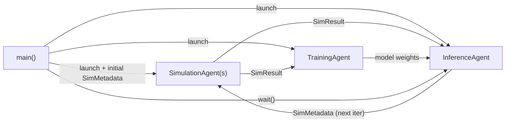

## Quick Start

A minimal example of the DeepDriveWE pattern.

It uses placeholder agents to demonstrate the simulation-training-inference data flow without requiring any MD simulation, deep learning, etc dependencies.

Run the example locally (no authentication required):
```bash
pip install academy-py
python main.py
```

Or run via the Academy Exchange Cloud (requires Globus authentication):
```bash
python main.py --exchange globus
```

> **Note:** If using the cloud exchange, run the authentication prior to submitting a batch job script. This will cache a Globus auth session token on the machine that will be reused.

This launches three agent types that communicate asynchronously via `SimResult` and `SimMetadata` objects:



**SimulationAgent** receives `SimMetadata`, runs a (mock) simulation, and sends the `SimResult` to both the TrainingAgent and InferenceAgent.

**TrainingAgent** trains on each `SimResult` as it arrives (streaming) and sends updated model weights to the InferenceAgent.

**InferenceAgent** collects `SimResult`s from all simulations in a batch. Once the full batch is received, it runs inference and kicks off the next iteration by sending new `SimMetadata` to each SimulationAgent. After reaching `max_iterations`, it shuts itself down.

**main()** launches all agents, sends the initial `SimMetadata` to start iteration 1, then calls `manager.wait()` until the InferenceAgent signals completion.
