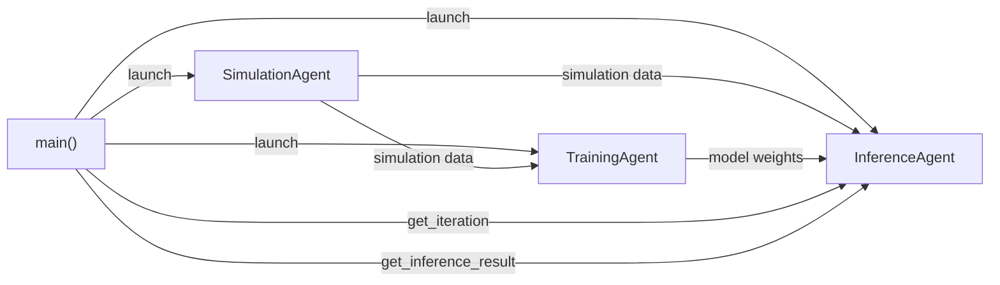

## Quick Start

A minimal example of the DeepDriveWE pattern.

It uses placeholder agents to demonstrate the simulation-training-inference data flow without requiring any MD simulation, deep learning, etc dependencies.

Run the example locally (no authentication required):
```bash
pip install academy-py
python main.py
```

Or run via the Academy Exchange Cloud (requires Globus authentication):
```bash
python main.py --exchange globus
```

> **Note:** If using the cloud exchange, run the authentication prior to submitting a batch job script. This will cache a Globus auth session token on the machine that will be reused.

This launches three agents that communicate asynchronously:



**SimulationAgent** runs a simulation and sends the results to both the
TrainingAgent and InferenceAgent.

**TrainingAgent** trains on the simulation data and sends updated model weights to the InferenceAgent.

**InferenceAgent** runs inference using the latest model weights.

**The main loop** polls the InferenceAgent for completion before starting the next iteration.
