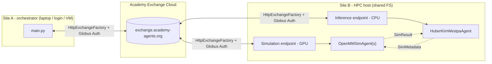

## Multi-site OpenMM NTL9 Folding with Huber-Kim Weighted Ensemble

A production-ready example that runs the DeepDriveWE **orchestrator**
on one host (your laptop, a login node, or a cloud VM) and dispatches
**OpenMM simulation agents** and the **WESTPA resampling agent** to a
remote HPC site via two pre-configured
[Globus Compute](https://www.globus.org/compute) endpoints — one GPU
endpoint for simulations and one CPU endpoint for inference. The
orchestrator and the endpoints communicate through the
[Academy Exchange Cloud](https://docs.academy-agents.org/stable/)
using Globus Auth — no VPN or shared filesystem required between the
orchestrator and the HPC site.

### Architecture



The orchestrator owns the ensemble bootstrap (basis-state pcoord
init, `params.yaml`, initial checkpoint path) and drives the Manager.
`OpenMMSimAgent`s run on the **simulation endpoint** (GPU-pinned),
while the `HuberKimWestpaAgent` runs on the **inference endpoint**
(CPU-only). Both endpoints typically live on the same HPC host so
they share `output_dir` for checkpoints; if they live on different
hosts, `output_dir` must be on a shared filesystem reachable from
both. Pcoords and contact maps travel over the exchange as
serialized `SimResult` payloads — the orchestrator never opens
simulation files directly.

> **Single-endpoint mode.** `inference_endpoint_id` is optional. If
> you omit it, the `HuberKimWestpaAgent` runs locally on the
> orchestrator in a `ThreadPoolExecutor` (same pattern as the
> single-site example) and only simulations go to the remote GPU
> endpoint. Useful when you don't want to provision a second
> endpoint or when the orchestrator host has cheap filesystem
> access to the checkpoint directory.

### Prerequisites

Tested on **Python 3.11**.

**Both hosts:**
- Python 3.11 with this repository installed: `pip install -e '.[dev]'`
- `pip install globus-compute-sdk globus-compute-endpoint`
- A Globus account and completed Globus Auth flow

**HPC endpoint host (site B):**
- OpenMM + MDAnalysis + mdtraj. Conda or micromamba recommended:

  ```bash
  # conda
  conda install -c conda-forge openmm=8.1
  # or micromamba (drop-in; faster solver, smaller footprint)
  micromamba install -c conda-forge openmm=8.1
  ```

  See the top-level [README](../../README.md) for the full MD env.
- Two running Globus Compute endpoints — one for simulations (GPU)
  and one for inference (CPU). On a single workstation both endpoints
  live on the same host, share the filesystem, and share the same
  micromamba env; they just differ in their `engine` shape.

  ```bash
  # Simulation endpoint: GPU, one worker per H100.
  globus-compute-endpoint configure deepdrivewe-sim
  # Edit ~/.globus_compute/deepdrivewe-sim/config.yaml (see below).
  globus-compute-endpoint start deepdrivewe-sim
  # -> UUID goes into globus_compute.simulation_endpoint_id

  # Inference endpoint: CPU, one worker for the WESTPA agent.
  globus-compute-endpoint configure deepdrivewe-inf
  # Edit ~/.globus_compute/deepdrivewe-inf/config.yaml (see below).
  globus-compute-endpoint start deepdrivewe-inf
  # -> UUID goes into globus_compute.inference_endpoint_id
  ```

  **Simulation endpoint (`deepdrivewe-sim`).** On a single NVIDIA
  workstation with 8 H100s, a `LocalProvider` engine that pins one
  worker per GPU via `available_accelerators` works well. Replace
  the generated `~/.globus_compute/deepdrivewe-sim/config.yaml`
  with:

  ```yaml
  display_name: DeepDriveWE workstation (8x H100)

  engine:
    type: GlobusComputeEngine
    max_workers_per_node: 8
    # Integer form of available_accelerators assigns one worker per
    # GPU by setting CUDA_VISIBLE_DEVICES=<worker_index> on launch.
    available_accelerators: 8

    provider:
      type: LocalProvider
      init_blocks: 1
      min_blocks: 1
      max_blocks: 1

      # worker_init runs in each worker shell before the Python
      # process starts. Activate the micromamba env with OpenMM +
      # this repo, and put the example dir on PYTHONPATH so workers
      # can import workflow.py.
      #
      # MAMBA_EXE points at the micromamba *binary*; MAMBA_ROOT_PREFIX
      # points at the micromamba *data root* (where envs/ lives).
      # These are the defaults from `micromamba shell init`; adjust
      # if your install uses different locations.
      worker_init: |
        # Point this at wherever this example is cloned on the host.
        EXAMPLE_DIR="$HOME/deepdrivewe-academy/examples/openmm_ntl9_hk_multisite"

        export MAMBA_EXE="$HOME/bin/micromamba"
        export MAMBA_ROOT_PREFIX="$HOME/micromamba"
        eval "$("$MAMBA_EXE" shell hook --shell bash --root-prefix "$MAMBA_ROOT_PREFIX")"
        micromamba activate deepdrivewe

        export PYTHONPATH="$EXAMPLE_DIR:$PYTHONPATH"

        # Fresh per-worker run dir. mktemp -d atomically creates a
        # uniquely-named directory so concurrent workers never collide.
        # Dirs look like results/run-20260415-aB3xK9pQ/ (date + random).
        mkdir -p "$EXAMPLE_DIR/results"
        RUN_DIR=$(mktemp -d "$EXAMPLE_DIR/results/run-$(date +%Y%m%d)-XXXXXXXX")
        cd "$RUN_DIR"
  ```

  Notes:
  - `available_accelerators: 8` is the canonical way to pin one
    worker per GPU on a multi-GPU host — Globus Compute sets
    `CUDA_VISIBLE_DEVICES` per worker for you, so OpenMM picks up
    exactly one H100.
  - `init_blocks: 1` / `max_blocks: 1` keep a single Parsl block
    (one HTEX manager for the whole workstation).
  - The env activated by `worker_init` must contain OpenMM 8.1, this
    repository (`pip install -e .`), and `globus-compute-sdk`.
  - If you prefer conda, swap the micromamba block for
    `source "$HOME/miniconda3/etc/profile.d/conda.sh" &&
    conda activate deepdrivewe`.

  **Inference endpoint (`deepdrivewe-inf`).** The WESTPA agent is
  single-threaded and CPU-bound (binning, resampling, checkpointing),
  so one worker is enough. Replace
  `~/.globus_compute/deepdrivewe-inf/config.yaml` with:

  ```yaml
  display_name: DeepDriveWE inference (CPU)

  engine:
    type: GlobusComputeEngine
    max_workers_per_node: 1
    # No GPU pinning -- this endpoint runs the resampler, not MD.

    provider:
      type: LocalProvider
      init_blocks: 1
      min_blocks: 1
      max_blocks: 1

      # Same env + PYTHONPATH setup as the simulation endpoint so the
      # worker can import workflow.py and access the shared output_dir.
      worker_init: |
        EXAMPLE_DIR="$HOME/deepdrivewe-academy/examples/openmm_ntl9_hk_multisite"

        export MAMBA_EXE="$HOME/bin/micromamba"
        export MAMBA_ROOT_PREFIX="$HOME/micromamba"
        eval "$("$MAMBA_EXE" shell hook --shell bash --root-prefix "$MAMBA_ROOT_PREFIX")"
        micromamba activate deepdrivewe

        export PYTHONPATH="$EXAMPLE_DIR:$PYTHONPATH"

        mkdir -p "$EXAMPLE_DIR/results"
        RUN_DIR=$(mktemp -d "$EXAMPLE_DIR/results/run-$(date +%Y%m%d)-XXXXXXXX")
        cd "$RUN_DIR"
  ```

### Quick Start

1. Start both Globus Compute endpoints on the HPC host and note the
   two UUIDs.
2. Pre-stage this example directory on the HPC host (e.g. clone the
   repo there). Paths inside `config.yaml` must resolve to the same
   files on both hosts (see **Path Handling** below).
3. Edit `config.yaml`:
   - `globus_compute.simulation_endpoint_id` — the sim endpoint UUID.
   - `globus_compute.inference_endpoint_id` — the inference endpoint
     UUID. Optional: omit (or leave commented) to run the WESTPA
     agent locally on the orchestrator instead of on a second
     endpoint.
   - `sim_output_dir` — an absolute HPC scratch path for trajectories.
4. Run the orchestrator locally:

   ```bash
   cd examples/openmm_ntl9_hk_multisite
   python main.py -c config.yaml --exchange globus
   ```

### Smoke Test (Single Host)

To validate the scaffold without provisioning a Globus Compute
endpoint, run in local mode. Simulation agents run in a local
`ThreadPoolExecutor` and all traffic stays in-process.

```bash
python main.py -c config.yaml --exchange local
```

Local mode does not require `globus-compute-sdk`. Adjust
`sim_output_dir` to a local path (e.g. `results/simulation/`) first.

### Path Handling

Because the orchestrator and the simulation agents can live on
different hosts with different filesystems, be deliberate about which
host resolves which path:

| Path | Resolved on | Notes |
|---|---|---|
| `output_dir` | orchestrator | Auto-resolved + created at load time. Holds checkpoints, `params.yaml`, `runtime.log`. |
| `sim_output_dir` | simulation host | Passed verbatim to the sim agent. Use an **absolute** HPC path for `--exchange globus`; relative is fine for `--exchange local`. |
| `basis_states.basis_state_dir` | both | Opened on the orchestrator for pcoord init AND on the sim host for iter-0 restart files. Must resolve to the same files on both sides (pre-stage identical layouts, or use an absolute path that exists on both). |
| `basis_state_initializer.reference_file` | orchestrator | Used once at init to compute initial pcoords. |
| `simulation_config.reference_file` | simulation host | Opened by the sim agent. Not validated at load time — an invalid path will fail during the first iteration. |

Rules of thumb:

- Never let an absolute path resolved on one host leak to the other.
  `SimulationConfig` is pickled across hosts, so its Path fields are
  **not** `.resolve()`d at load time.
- `SimResult` / `SimMetadata` carry pcoords and contact maps through
  the exchange; restart files stay on the simulation host.
- If `inputs/` and `common_files/` are the bundled relative paths
  (the defaults), run the orchestrator from this directory and ensure
  the HPC endpoint worker's cwd is the same relative directory (or
  use absolute paths in the YAML).

### File Structure

```
openmm_ntl9_hk_multisite/
├── main.py            # Orchestrator entry point
├── workflow.py        # Agent subclasses + Pydantic config models
├── config.yaml        # Experiment + Globus Compute settings
├── common_files/
│   └── reference.pdb  # Folded reference for RMSD
└── inputs/
    └── bstates/
        └── ntl9.pdb   # Starting (unfolded) basis state
```

### Configuration Reference

| Parameter | Default | Description |
|---|---|---|
| `num_iterations` | 100 | Number of WE iterations |
| `output_dir` | `results/` | Orchestrator outputs (checkpoints, logs) |
| `sim_output_dir` | `results/simulation/` | Simulation outputs (HPC scratch) |
| `simulation_config.openmm_config.simulation_length_ns` | 0.01 | MD segment length per iteration (ns) |
| `simulation_config.openmm_config.temperature_kelvin` | 300.0 | Simulation temperature |
| `simulation_config.openmm_config.solvent_type` | implicit | Solvent model |
| `inference_config.sims_per_bin` | 4 | Walker count target per bin |
| `target_states[0].pcoord` | `[1.0]` | RMSD threshold for the folded state (Å) |
| `globus_compute.simulation_endpoint_id` | — | GPU endpoint UUID (OpenMM simulations) |
| `globus_compute.inference_endpoint_id` | `null` | CPU endpoint UUID (WESTPA resampler). Optional; when unset, the resampler runs locally on the orchestrator. |

### Stopping a Running Workflow

Ctrl+C on the orchestrator triggers shutdown. Both `GCExecutor`s are
closed in the `finally` block; agents on the endpoints terminate
when the exchange connection drops. To stop only the HPC side, stop
the Globus Compute endpoints
(`globus-compute-endpoint stop deepdrivewe-sim` and
`globus-compute-endpoint stop deepdrivewe-inf`).

### Extending This Example

**Multiple simulation sites** — register several `GCExecutor`s under
distinct executor names (e.g. `{'gpu-alcf': ..., 'gpu-olcf': ...}`)
and launch agents with `sim_executor='gpu-alcf'` / `'gpu-olcf'`.

**Resuming** — rerun with the same `output_dir`; the latest
checkpoint is loaded automatically.

**Custom resampling / progress coordinates** — see the single-site
[openmm_ntl9_hk](../openmm_ntl9_hk/) example for subclassing
`SimulationAgent` / `WestpaAgent`.
